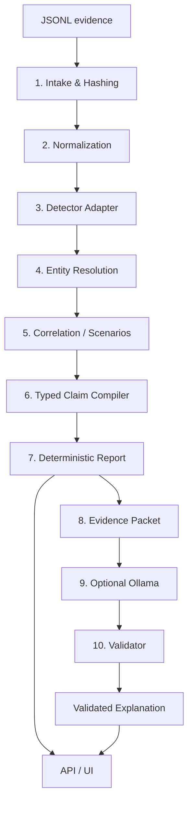

# Sentinel Evidence

> A local-first, evidence-grounded security investigation system for Windows telemetry that strictly enforces "Evidence first, claims second, explanation last."

## Team

**Team Name:** Sentinel Team (Update this if you have a specific team name)

| Member | Contribution   |
| ------ | -------------- |
| Sujan  | Evidence Intake, Validation, Normalization, and SQLite Storage |
| Pramit | Entity/Process Resolution and Correlation |
| Jana   | Scenarios and Typed Claims |
| Sujai  | Evidence Packet, Local AI, FastAPI, React, and Security |

## Problem Statement

### The Problem

In security operations, analyzing Windows telemetry (like EVTX/JSONL logs) often leads to assumptions and hallucinations—both by human analysts and AI tools. Systems frequently infer causality from timestamp proximity or jump to conclusions (e.g., assuming exfiltration simply because a flagged process made an outbound connection) without concrete support sets, leading to false positives and unreliable investigations.

### Why We Chose This Problem

We chose this problem because security tooling must never turn telemetry into a stronger conclusion than the evidence supports. Ensuring that findings are strictly grounded in verifiable, deterministic evidence before applying AI explanations is crucial for trustworthy security investigations.

## Solution

Sentinel Evidence is a local-first system that ingests documented JSONL evidence, normalizes it, resolves process identity, correlates bounded activity patterns, and compiles typed claims with exact support sets. It only uses an optional local Ollama model for explanation *after* deterministic validation, presenting the result through a FastAPI + React case viewer.

### Key Features

- **Evidence-First Architecture:** Normalizes logs into deterministic events before any claim generation.
- **Strict Entity Resolution:** Uses `(host, ProcessGuid)` identity with bounded PID fallback, leaving ambiguous identities unresolved rather than unsafe merging.
- **Typed Claim Compiler:** Correlates scenarios (e.g., suspicious parent/child execution, flagged process + file creation) into verifiable claims.
- **AI Validator:** Uses a local model (Ollama) strictly to explain approved claims, actively blocking hallucinations of new facts, entities, or unsupported ATT&CK assertions.

## Innovation and Differentiation

Unlike typical SIEMs or AI security copilots that dump data into an LLM, Sentinel Evidence enforces a "Freeze Before Coding" contract where deterministic rules map exactly to raw evidence locators. If a single supporting event is removed from a claim, the claim automatically disappears or downgrades to "insufficient_evidence". The system is designed to work correctly with no model and no UI.

## Technical Implementation

### Architecture



### Technology Stack

| Category        | Technologies                |
| --------------- | --------------------------- |
| Frontend        | React, TypeScript           |
| Backend         | Python, FastAPI             |
| Database        | SQLite                      |
| AI / ML         | Ollama (Local LLM)          |
| Infrastructure  | Local-first                 |
| APIs / Services | N/A                         |

### How It Works

The system operates in a strict pipeline: raw JSONL is ingested, hashed, and normalized into `Events` stored in SQLite (Sujan). Process identities are resolved and correlated into typed `Edges` and `Claims` (Pramit). The backend exposes case-scoped endpoints using FastAPI, consumed by a React viewer that distinguishes between observed facts, hypotheses, and AI drafts (Jana). Optionally, verified claims are packed into an evidence budget and passed to a local Ollama model to generate an explanation, which is then verified against the original facts before presentation (Sujai).

### Technical Decisions

- **Single Python Package & SQLite MVP:** Avoided microservices, Kafka, graph databases, or vector databases to ensure a tight, deterministic local-first MVP.
- **Strict Evidence Removal Rule:** If the only supporting record for a claim is removed, the claim is invalidated immediately.
- **Bounded Fallback:** PID matching is bounded by host, time interval, and context; ambiguous matches are explicitly left unresolved.

## Implementation During the Hackathon

The core deterministic pipeline was implemented alongside the UI and AI integration.

### Team Contributions

- **Sujan:** Built the intake pipeline, manifest handling, Sysmon normalization, SQLite repository, and deterministic event IDs.
- **Pramit:** Implemented entity resolution and correlation.
- **Jana:** Implemented the three MVP scenarios, typed claim compilation, support sets, and contradiction logic.
- **Sujai:** Built the FastAPI endpoints, case isolation, React/TypeScript case viewer, and API security tests. Evidence Packet and Local Ollama integration remain assigned but are not present in the integrated branch.

## Working Application

**Live Application:** [Add Live URL or N/A if running locally only]

[Briefly explain how to access the deployment, or state that it is designed to run locally.]

## Demo Video

**Demo Video:** [Add Video URL]

[Provide a short demonstration of the working project.]

## Open Source and AI Usage

### AI / Models

- **Ollama (Local Model):** Used strictly to explain deterministically approved claims in simpler language. Validated to prevent hallucinating events, entities, or unsupported assertions.

### Open Source Components

- **React & TypeScript:** Frontend UI and Case Viewer.
- **FastAPI (Python):** Backend API and case-scoped endpoints.
- **SQLite:** Local storage of normalized events, edges, and claims.

## Setup and Usage

### Prerequisites

- Python 3.10+
- Node.js (for React frontend)
- Ollama (installed locally for AI features)
- `uv` package manager (optional, based on your repo structure)

### Installation

```bash
git clone https://github.com/sujan28-rgb/hacktoberfest-hack-day-coimbatore-x-init-club-and-idea-club.git
cd hacktoberfest-hack-day-coimbatore-x-init-club-and-idea-club

# Setup Python Backend
python3 -m venv .venv
source .venv/bin/activate
pip install -e '.[test]'

# Setup Frontend
cd web
npm ci
```

### Environment Variables

```env
# Optional environment variables if needed
```

### Running the Project

```bash
# Start Backend
uvicorn sentinel_evidence.api.app:app --reload

# Start Frontend (in a second terminal)
cd web
npm run dev
```

### Usage

1. Ingest documented JSONL evidence using the CLI or API.
2. View the deterministically generated claims in the React UI.
3. Drill down into the timeline to view raw supporting evidence locators.
4. (Optional) Run the local Ollama explanation to view human-readable summaries of supported inferences.

## Devpost Submission

**Devpost Project:** [Add Devpost Project URL]

## Credits and License

### Credits

- Built by Sujan, Pramit, Sujai, and Jana.

### License

[Add License]

## Submission Checklist

- [x] Project title and description added
- [x] All team members listed
- [x] Problem clearly explained
- [x] Reason for choosing the problem explained
- [x] Solution and key features documented
- [x] Innovation and differentiation explained
- [x] Architecture included
- [x] Technical implementation documented
- [x] Work completed during the hackathon documented
- [x] Team contributions documented
- [ ] Working application is functional
- [ ] Live application link added where applicable
- [ ] Demo video added
- [x] AI and open-source components documented
- [ ] Setup and usage instructions tested
- [ ] Challenges and learnings documented
- [ ] Devpost submission completed
- [ ] Devpost link added
- [ ] Credits added
- [ ] License added
- [x] Repository is organized and complete
